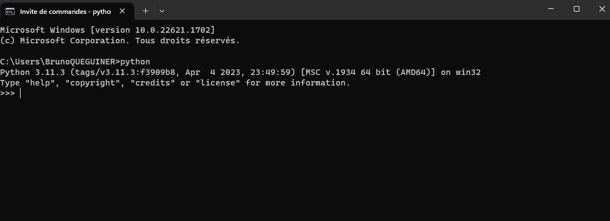

# Application PCOE

## Guide d'installation pour Windows

### Cloner le projet

Vous pouvez récupérer les fichiers nécessaires au projet en utilisant Git ([lien d'installation](https://git-scm.com/downloads)) en ligne de commande.

```
cd /path/to/my/project/directory
https://gitlab.seenovate.com/seenovate/interne/app-pcoe.git
```

### Python 3.9.7

1. Téléchargez l'installeur Python version 3.9.7 en cliquant [ici](https://www.python.org/ftp/python/3.9.7/python-3.9.7-amd64.exe).
2. Lancez l'installeur et effectuez l'installation.
3. Testez l'installation de Python en ouvrant une invite de commande et lancez la commande `python`. Vous devriez accéder à la console Python. Si ce n'est pas le cas, vérifiez que le dossier où se trouve l'exécutable python.exe a bien été ajouté à la variable d'environnement Windows PATH.

   

4. Créer votre environnement virtuel Python

   Un environnement virtuel est un répertoire contenant une installation de Python autonome (indépendante de celle du système d’exploitation). Il est particulièrement pratique pour que tous les développeurs utilisent les mêmes versions des packages Python. Le fichier **requirements.txt** sert à lister les packages nécessaires pour le projet ainsi que leurs versions utilisées.

   ```
   cd /path/to/my/project
   py -3.9 -m venv app_pcoe_venv 
   cd ./app_pcoe_venv/Scripts
   ./activate
   cd ../..
   pip install --upgrade pip
   pip install -r requirements.txt
   ```

   Pour ne plus utiliser l'environnement virtuel **app_pcoe_venv**, lancez la commande `deactivate`.

5. Lancez le programme

   ```
   python ./index.py
   ```

### Base de données

Les données sont stockées dans une base de données PostgreSQL de version **15.3**.
Pour l'environnement de développement, la base de données PostgreSQL peut être inclus au sein d'un Docker. La procédure de mise en place de la base de données en local est décrite ci-dessous.

1. Télécharger, installer et démarrer [Docker](https://docs.docker.com/get-docker/).
2. Se placer dans le dossier racine du projet : **app-pcoe**
3. Créer la base de données **pcoe**
    * Créer l'image Docker **postgresql_pcoe_image** avec la commande `docker build -f ./Dockerfile_postgresql -t postgresql_pcoe_image .`  
      Lors de la création de l'image, le script SQL d'initialisation **init.sql**, qui est chargé de créer un utilisateur et les tables, est exécuté.  
      Vous pouvez vérifier que l'image a bien été créée en lançant la commande `docker images`
    * Démarrer le conteneur **postgresql_pcoe_container** avec la commande `docker run -d --name postgresql_pcoe_container -p 5435:5432 postgresql_pcoe_image`  
      Le port 5432 (le port par défaut des BDD PostgreSQL) du conteneur est redirigé vers le port 5435 de votre PC.  
      Vous pouvez vérifier l'état du conteneur en lançant la commande `docker ps`, et vous pouvez arrêter et démarrer le conteneur avec les commandes `docker stop postgresql_pcoe_container` et `docker start postgresql_pcoe_container`.
4. Tester les connexions

   Ouvrez un client SQL et créez une connexion avec les informations suivantes.

5. Pré-charger les data :
    Utiliser le fichier load_data.py pour précharger les données.


* **PCOE**

| Environnement | DEV                  | PROD |
|---------------|----------------------|------|
| **host**      | localhost            | ???  |
| **port**      | 5435                 | ???  |
| **database**  | pcoe                 | ???  |
| **user**      | pcoe                 | ???  |
| **password**  | iRMUVCCU8Z7lyyvtizJt | ???  |

> Je conseille d'utiliser le client SQL [DBeaver](https://dbeaver.io/). Il supporte toutes les bases de données les plus connues.


# Mode d'emploi : Template Dash 

# 1. Edition du portail 

## 1.1 Ajout d'une application 

Si l'on souhaite ajouter une nouvelle application au template, il suffit de : 
1. Créer un nouveau dossier « appN » à la racine de votre projet (N représentant le numéro de l’application) : à l'intérieur créer 2 fichiers : **layout.py** et **callbacks_appN.py**
2.	Remplir le fichier **list_app.csv** : celui-ci permet d'accéder aux informations relatives aux différentes applications. Ajouter une ligne à la suite des précédentes, et indiquer le titre de l'application, son url et l'icone qui la représentera sur la page d'accueil.
3.	Dans le fichier **layout.py** du dossier **appN**:
    1. Recopier cette section (et affecter à *n_app* le numéro associé à la nouvelle appli) : 
    ```python   
    ##Chargement fichier csv : pour gérer infos principales des différentes applis
    list_app = pd.read_csv("assets/list_app.csv", header=0, sep=';')
    n_app =  3 # numéro de l'appli
    ```

    2. Ajouter l'en-tête template : 
    ```python 
    dbc.Row([
        dbc.Col([   
            dbc.Navbar([
                    dbc.Col([dcc.Link(dbc.Button(html.Img(src=app.get_asset_url("accueil.png"),style={"height":"30px"}), id="bouton_accueil", style={'border':'2px solid white','margin-left':'-1vw'},color='white'), href = '/'),
                        html.Img(src=app.get_asset_url("logo_seenovate.png"), height="30px",style={'margin-left':'1vw'})],xs=2,sm=2,md=2,lg=2,xl=2),
                    dbc.Col([html.Div(dbc.NavbarBrand(list_app["name"].loc[list_app["ind"]==n_app].iloc[0], id="titre",className="text-white"),style={"textAlign":"center"})
                    ],xs=9,sm=9,md=9,lg=9,xl=9,align="center"),
                    dbc.Col([html.Div(html.Img(src=app.get_asset_url("user.png"), height="30px"))])
            ],color="dark")
        ],xs=12,sm=12,md=12,lg=12,xl=12)
    ]),  
    ```

    NB : l'ajout de ces lignes permet par ailleurs d'ajouter un bouton "accueil", qui redirige l'utilisateur à la page d'accueil. 

    Remplacer les images par les logos clients.

    
4.	Dans le fichier **layout.py** à la racine du projet :
    Si besoin, réajuster les *width* et *margin-left* entre les différentes *cards* (dans la partie *children*), afin que la liste des boutons renvoyant vers les applis sur la page d'accueil soit la plus agréable possible. Voir le fichier *BP_Python_Dash.docx* pour consulter les bonnes pratiques liées au caractère responsive d'une application Dash.

5.	Dans le **callbacks.py** à la racine du projet  : 
    1. Importer les éléments *layout_appN* : 
    ```python
    from app3.layout import layout_appN
    ```
    2.	dans la fonction *display_page*, ajouter les 2 lignes correspondant à la nouvelle application : 
    ```python
    elif pathname == '/appN':
	        content = layout_appN
    
    ``` 
    Cette fonction gère la redirection vers une des applications selon le choix de l'utilisateur sur le portail d'accueil.

6. Dans le fichier **index.py**, ajouter les lignes d'imports vers les nouveaux fichiers *layout* et *callbacks* :
```python
from app3 import layout, callbacks_app3
```

## 1.2. Pour supprimer une application

1. Dans le fichier *list_app.csv*, supprimer la ligne correspondante.

2. Supprimer tous les fichiers compris dans le dossier *appN*, ainsi que le dossier associé. 

3. Supprimer tous les imports des fichiers *layout* et *callbacks* à la racine. 
 


## 1.3. Pour changer l'apparence du favicon 

Pour changer le favicon (icône représentant l'application sur la barre d'onglets du navigateur web), il faut se rendre dans le fichier **app.py** :

```python
app.title = "Seenovate Dash App"
app._favicon = "logo_favicon.ico"
```
On peut alors modifier le titre ainsi que le logo de l'application, stocké dans le dossier *assets*.


## 1.4. Pour ajouter une authentification par mot de passe 

Si l'on souhaite restreindre l'accès à l'application à un certain nombre d'invididus, il suffit d'ajouter les lignes suivantes (et ajouter les couples ID/MDP correspondant) dans le fichier *index.py* : 

```python
VALID_USERNAME_PASSWORD_PAIRS = {
    'template': 'Seenovate1234' ,
 
}
 
auth = dash_auth.BasicAuth(
    app,
    VALID_USERNAME_PASSWORD_PAIRS
)
```

Autre alternative adoptée dans certains projets : **keycloack** (permet d'affecter à un utilisateur un groupe, et de lui proposer un contenu associé).


# 2. Les applications du Template :

1. Application 1 : Sidebar par onglet

Une application composée de plusieurs onglets, dans laquelle on retrouve divers graphiques *Plotly* usuels. A gauche, une sidebar pour chaque onglet qui permet de filtrer / sélectionner les données à afficher.

2. Application 2 : Sidebar commune à tous les onglets

Assez similaire à la première application, celle-ci propose néanmoins une sidebar commune, qui permet à l'utilisateur de filtrer les données une fois pour tous les onglets.

3. Application 3 : Formulaire de saisie 

Cette application est dédiée à la création de formulaires de saisies "statiques" : on renseigne une liste de champs et on l'enregistre dans une base de données.
Dans cette application, nous avons ajouté un *dbc.Modal* permettant de faire afficher le formulaire à l'intérieur d'une pop-up. Ceci est régulièrement utilisé pour les applications Dash Plotly. On retrouvera alors le callbacks permettant de gérer l'ouverture du Modal dans le fichier *callbacks_app3.py*. Enfin, on écrit les formulaires de saisie dans des objets *dc.Form*, qui sont dédiés à ce besoin, et permettent de gérer divers aspects (contrôle des champs obligatoires, bouton de validation du formulaire, design, ...).


## Autres fichiers du Template

1. Le fichier **colors.py** : dans ce fichier, on stocke les couleurs que l'on va utiliser dans le Template, en renseignant leur code couleur hexadécimal associé. Ceci a l'avantage d'éviter de rappeler le code couleur à l'intérieur de chaque fichier, et de créer des dictionnaires de couleurs "Corporate".

2. Le fichier **sheet.css** (dans le dossier *assets*) : celui-ci permet de gérer la partie CSS de l'application. Par exemple, on peut créer des classes d'objets (par exemple une classe "label_dropdowns" pour gérer le style de tous les noms de listes déroulantes).  

3. Le fichier **sql_utils.py** (dans le dossier *src*) : nous avons recensé des fonctions fréquemment utilisées pour travailler avec une base de données SQL (type PostgreSQL ici).

4. Le fichier **fonctions.py** (dans le dossier *src*) : Lorsqu’un bout de code est répété plusieurs fois faire une fonction. Cela permet de diminuer la longueur du code et de le rendre plus lisible. Mais surtout cela rend l’application plus maintenable et homogène.


## Conseils de développement 

Si vous travaillez avec plusieurs objets voués à effectuer la même action (ex : des Dropdowns que l'on souhaite tous afficher selon une même condition, ou un indicateur rouge ou vert à faire afficher pour chaque input), il est utile d'utiliser les composantes MATCH et ALL de Dash. Celles-ci permettent d'affecter un type d'id à chacun de nos objets (ex : dbc.Dropdown,dbc.Input, etc) et de contrôler l'affichage de tous les objets d'un même type dans le même callbacks.
Ces aspects sont détaillés sur le lien suivant : https://dash.plotly.com/pattern-matching-callbacks

### Lancement et utilisation de l’Application appPCOE
Cette application Dash, nommée **appPCOE**, est conçue pour la gestion de données liées aux contrats clients et aux projets. Elle permet de visualiser, saisir, modifier et générer des devis pour les contrats.

## Table des matières
- [Lancement de l'application](#lancement-de-lapplication)
- [Chargement des Données Initiales](#Chargement-des-Donnees-Initiales)
- [Mise en page](#mise-en-page)
- [Callbacks](#callbacks)

## Lancement de l'application
Pour lancer l'application appPCOE, suivez ces étapes :
1.	Assurez-vous que votre base de données est correctement configurée avec les données nécessaires.
2.	Exécutez l'application en utilisant la commande suivante :
```python

python index.py 

```
L'application sera accessible à l'adresse http://localhost:8050 depuis votre navigateur.

## Chargement des Données Initiales
Pour que l'application fonctionne correctement, vous devez charger des données initiales. Ces données sont stockées dans une base de données. Voici comment les charger :
1.	Prérequis
Les fichiers CSV nécessaires pour le chargement des données doivent être présents dans le répertoire de l'application.
2.	Étapes pour Charger les Données Initiales
Ouvrez un terminal ou une ligne de commande.
Accédez au répertoire de l'application :
```python

cd chemin/vers/votre/projet/AppPCOE 

```
Exécutez le script load_data.py en utilisant la commande Python :
```python

python load_data.py 

```
Le script extraira les données des fichiers CSV, les traitera, puis les chargera dans la base de données de l'application.
Une fois que le script a terminé son exécution, les données initiales sont prêtes à être utilisées dans l'application.
C'est tout ! Vous avez maintenant chargé avec succès les données initiales pour votre application.
Note : Assurez-vous que les fichiers CSV requis pour le chargement des données sont présents dans le répertoire de l'application avant d'exécuter le script load_data.py.

## Mise en page (« Layout »)
L'application appPCOE est composée de plusieurs composants interactifs, organisés en onglets et sous-onglets, pour faciliter la gestion des données clients et projets. Voici un aperçu de la mise en page :
Tableau de données clients
Filtres
Boutons d'action (saisie, génération de devis, résiliation)
Tableau de données projets
Informations détaillées sur le projet
Carte "Alertes"
Carte "Données calculées"
Boutons et formulaires de génération de devis
Pop-up Modifier la saisie
Formulaire pour la mise à jour des informations contractuelles
Pop-up Résilier
Confirmation pour la résiliation client
## Callbacks
L'application appPCOE utilise plusieurs callbacks pour répondre aux interactions de l'utilisateur. Voici quelques-uns des principaux callbacks :
Callback pour rendre les boutons de saisie et de génération de devis cliquables.
Callback pour exporter des devis au format ZIP.
Callback pour stocker les données de la ligne sélectionnée.
Callback pour remplir les champs du modal pop-up "Modifier la saisie".
Callback pour mettre à jour les données du tableau.
Callback pour gérer l'ouverture du pop-up "Résilier".
Callback pour mettre à jour les couleurs des badges d'alerte.
Callback pour afficher le nombre de lignes validées.

